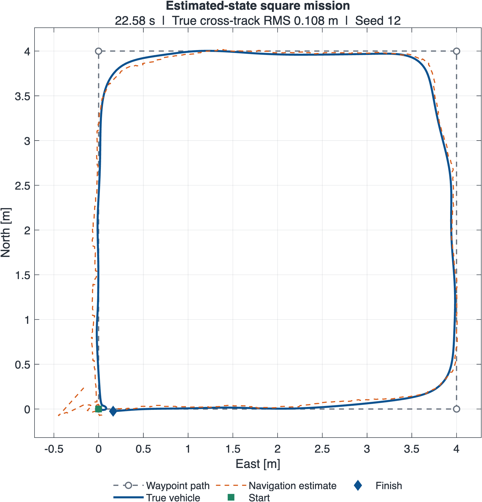
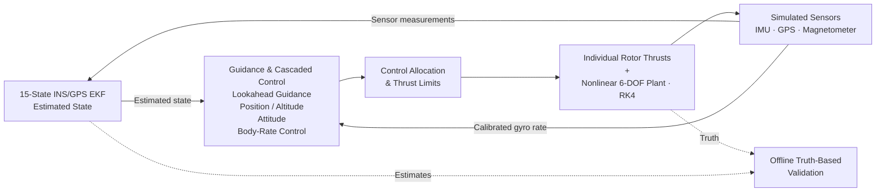
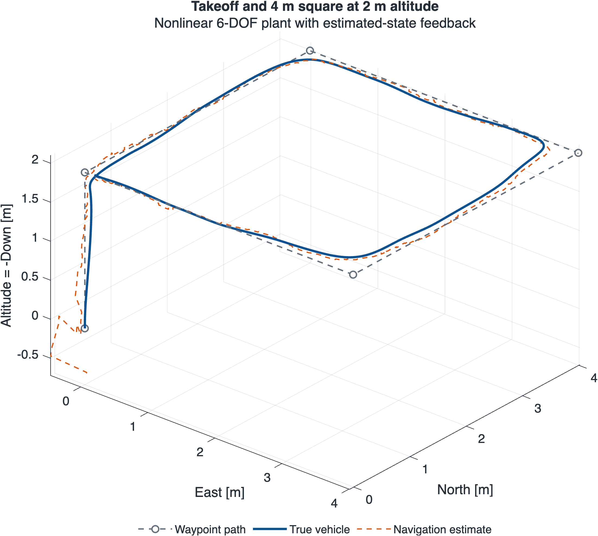
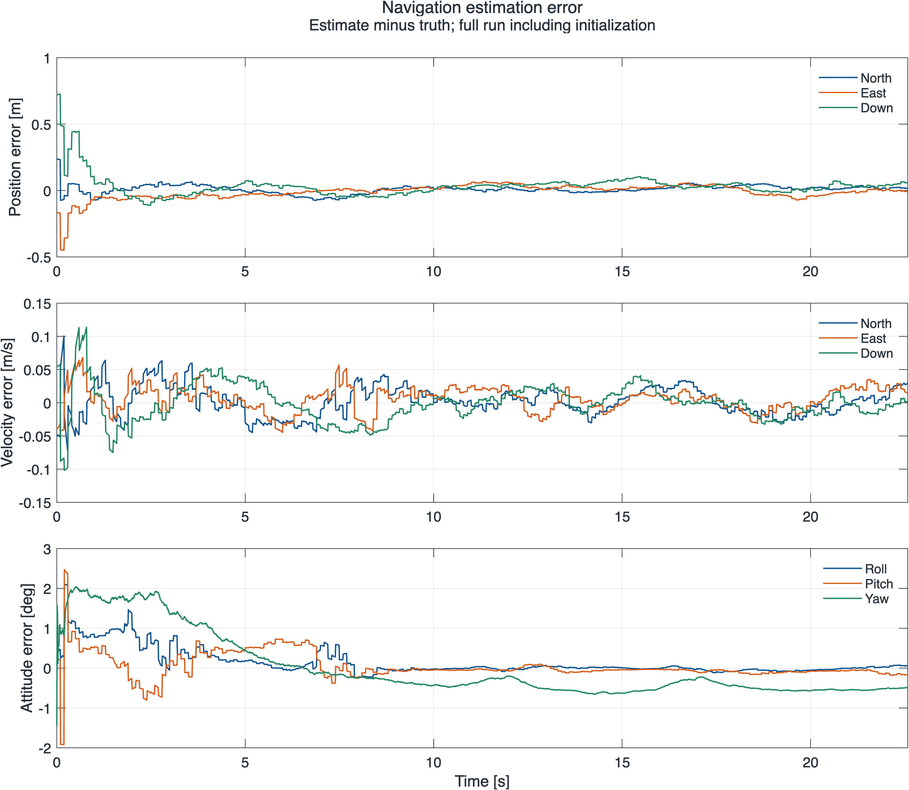
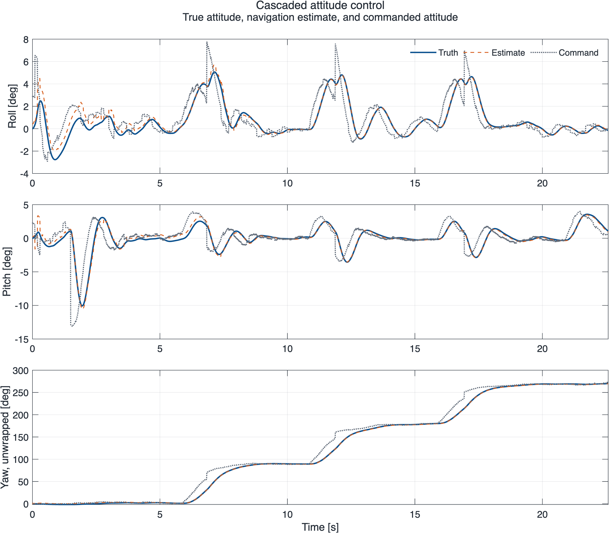

# Quadrotor Guidance, Navigation & Control

An independent MATLAB project implementing a complete guidance, navigation, and control stack around a nonlinear quadrotor model. The final demonstration takes off to 2 m, follows a 4 m square, and settles near the final waypoint using estimated position, velocity, and attitude.

**Reference mission:** 22.58 s · **True cross-track RMS:** 0.108 m · **Final true waypoint error:** 0.168 m



This project is a software-in-the-loop MATLAB simulation and has not been validated on flight hardware.

## Run the demonstration

1. Clone or download this repository.
2. Open the repository folder in MATLAB and run **`main.m`**, or type:

   ```matlab
   main
   ```

The launcher calls [`simulations/test_estimated_state_mission.m`](simulations/test_estimated_state_mission.m), the canonical integrated mission. It sets up project paths, resets the workspace and figures, uses the existing `rng(12)` seed, prints metrics, and exports:

- Seven figures to `figures/` as 300-dpi PNGs.
- Full histories and configuration to `results/full_gnc_mission.mat`.
- Measured metrics and MATLAB version information to `results/mission_metrics.json`.

Run outputs in `results/` are ignored by Git; selected reference PNGs are committed. Running the demo overwrites these generated outputs. Execution was verified with **MATLAB R2026a on macOS (Apple silicon)**; the demo's dependency report lists MATLAB only. Other releases and GNU Octave have not been validated.

To check the seeded reference run and the navigation interface:

```matlab
main
check_mission_results(results)
test_navigation_output
```

To regenerate figures from a saved run without simulating again:

```matlab
addpath('utilities')
load('results/full_gnc_mission.mat', 'results')
plot_mission_results(results)
```

## Implementation and capabilities

I implemented and integrated the MATLAB vehicle dynamics, rotor allocation, cascaded controllers, waypoint and lookahead guidance, sensor models, and navigation estimators. Development progressed from isolated plant/controller checks and simple Kalman filters to a coupled INS/GPS EKF and a complete mission with estimated-state feedback. The [validation index](simulations/README.md) preserves that progression.

The final implementation includes:

- Nonlinear 6-DOF rigid-body dynamics with individual rotor thrust inputs.
- Three-dimensional polyline lookahead guidance and estimated-state mission completion.
- Cascaded horizontal position/velocity, altitude, attitude, and body-rate control.
- IMU, GPS position/velocity, and magnetometer simulation with bias and noise.
- A coupled 15-state full-state Euler-angle INS/GPS EKF with bias estimation.
- Explicit multi-rate scheduling, logged truth/estimate comparisons, and reproducible plots.

## Architecture



Truth drives only the simulated plant, sensor generation, and offline metrics/plots. Guidance and the outer control loops receive navigation estimates. The rate loop uses measured gyro rates with the configured constant gyro calibration bias removed; it does not use true body rates or the EKF bias estimate.

### Frames and state definitions

The inertial frame is **North–East–Down (NED)**. Body axes are **x forward, y right, z down**. Attitude uses 3-2-1 Euler angles (yaw–pitch–roll), and plotted altitude is **−Down**. SI units are used internally, with angles in radians.

```text
Plant: x = [N E D u v w phi theta psi p q r]'
           └─NED─┘ └body┘ └──Euler──┘ └rates┘

EKF: x_nav = [pN pE pD vN vE vD phi theta psi bgx bgy bgz bax bay baz]'
              NED position / velocity       gyro bias    accel bias
```

Plant `u,v,w` are **body-frame** velocities; navigation velocities are **NED**. `rotation_matrix(phi,theta,psi)` maps body vectors into NED. The truth-feedback controller wrappers use it before the outer loops; the final mission directly uses `nav.velocity` in NED.

### Vehicle and control

The plant models a 1.50 kg X-configuration quadrotor with a 0.225 m center-to-rotor arm, diagonal inertia, gravity, body-frame translational dynamics, Euler kinematics, and rigid-body rotational coupling. Rotor thrust acts along −body z; arm moments and a thrust-proportional reaction-torque model produce the commanded wrench.

Horizontal position error generates a bounded velocity command, then a bounded acceleration command. Heading-aligned accelerations map to roll/pitch commands using a near-hover approximation and a 20° tilt limit. The altitude cascade uses Down position/velocity and compensates collective thrust for tilt. Proportional attitude control produces limited body-rate commands, and proportional rate control produces body moments.

Allocation solves the 4 × 4 thrust/moment mapping and clips each rotor to **0–8 N**. The achieved wrench can therefore differ from the requested wrench during saturation; this is a direct solve with clipping, not a constrained optimal allocator.

### Guidance and mission

Lookahead guidance projects the estimated position onto the active finite path segment, then walks **1.0 m** ahead along the polyline to form a virtual position target. Vertical takeoff segments target their endpoint without extending lookahead into the next horizontal leg. Horizontal segments switch using along-track progress; yaw points toward the virtual target.

```matlab
waypoints = [ ...       % [North East Down], m
    0  0   0;
    0  0  -2;
    4  0  -2;
    4  4  -2;
    0  4  -2;
    0  0  -2];
```

Completion requires the final segment, estimated waypoint distance below **0.20 m**, and estimated speed below **0.15 m/s**. The final waypoint is at altitude; this demonstration does not include a landing sequence.

### Sensors and navigation

The IMU measures body angular rate and specific force, including fixed biases and Gaussian white noise. GPS provides noisy NED position and velocity. The magnetometer rotates a fixed normalized field into body axes and adds hard-iron bias and noise. In the final mission, the known simulated hard-iron bias is subtracted before the EKF, representing ideal sensor calibration rather than truth-state feedback. The assumed field has zero East component.

The EKF estimates NED position/velocity, Euler attitude, and three-axis gyro and accelerometer biases. Initial roll/pitch come from accelerometer direction, yaw from a tilt-compensated magnetometer heading, and translation from the first GPS sample. Subsequent steps use:

1. Bias-corrected IMU propagation and a **numerical state-transition Jacobian**.
2. Full covariance propagation with IMU uncertainty and bias random-walk process noise.
3. GPS position/velocity correction, with position-only fallback in the update interface.
4. A wrapped, tilt-compensated magnetometer yaw correction.
5. Joseph-form covariance updates and covariance symmetrization.

Cross-covariances allow GPS residuals to correct attitude and bias states indirectly. This is a **full-state Euler-angle EKF prototype**, not a quaternion or error-state estimator. The simulator injects fixed IMU biases; the filter's random-walk terms represent uncertainty in those states.

### Multi-rate execution

| Operation | Rate | Scheduling |
|---|---:|---|
| IMU, control, EKF prediction | 100 Hz | Every 0.01 s base tick; first EKF call initializes |
| Magnetometer generation/yaw update | 100 Hz | Every base tick |
| GPS generation/correction | 10 Hz | Every tenth tick |
| Guidance | 50 Hz | Every second tick; commands held between updates |
| Plant integration | 0.01 s step | RK4 with rotor commands held over each step |

These are simulated sample rates, not a measured real-time execution guarantee.

## Reference results

The fixed-seed mission was executed in MATLAB before and after repository cleanup. The recorded trajectory, estimates, commands, bias histories, cross-track histories, and final EKF state/covariance were **exactly identical** in that environment. See the [validation record](validation/README.md) and [machine-readable reference](validation/reference_metrics.json).

| Mission metric | Truth-based | Estimated / onboard |
|---|---:|---:|
| RMS cross-track error | 0.108 m | 0.126 m |
| Maximum cross-track error | 0.409 m | 0.777 m |
| Final waypoint distance | 0.168 m | 0.160 m |
| Completion time | — | 22.58 s |

| Navigation RMSE | North / Roll | East / Pitch | Down / Yaw |
|---|---:|---:|---:|
| Position [m] | 0.0339 | 0.0574 | 0.0907 |
| Velocity [m/s] | 0.0225 | 0.0202 | 0.0277 |
| Attitude [deg] | 0.3624 | 0.3488 | 0.8007 |

Cross-track error is the 3-D Euclidean distance to the **active finite segment**, including vertical error. Truth error is sampled at 100 Hz; onboard cross-track error is updated by guidance at 50 Hz and held between updates. Statistics include initialization and all logged samples. Navigation RMSE is estimate minus truth; angle differences are wrapped before computing RMSE. These results describe one seeded simulation, not a statistical robustness campaign.

Final true attitude is approximately **[−0.138°, 1.087°, 270.045°]**. The yaw is equivalent to −89.955°, consistent with the westbound final segment. Different random generators, seeds, configurations, or MATLAB platforms may change results.

## Selected simulation figures







Additional diagnostics: [cross-track error](figures/cross_track_error.png), [rotor thrust and clipping](figures/rotor_thrusts.png), and [mission speed](figures/mission_speed.png). Figures are exported directly from MATLAB simulation histories; yaw unwrapping is for display only.

## Repository guide

```text
main.m                 Thin launcher for the canonical final demonstration
config/                Vehicle, sensor, controller, and guidance parameters
dynamics/              Nonlinear plant, rotations, allocation map, control wrappers
control/               Position, altitude, attitude, rate control, and allocator
guidance/              Waypoint and polyline lookahead guidance
navigation/            Current EKF/sensors and documented developmental estimators
simulations/           Canonical mission and 19 earlier subsystem/development scripts
utilities/             Offline plotting and metrics export
validation/            Regression checks, reference metrics, and validation record
figures/               Real MATLAB reference plots
results/               Generated run data (ignored by Git)
```

[Subsystem validation index](simulations/README.md) · [Navigation development history](navigation/README.md)

## Limitations and future work

The current scope is a deterministic, idealized simulation demonstration. Vehicle and sensor models omit many hardware effects, including aerodynamic drag, motor dynamics, sensor latency, and calibration uncertainty. Euler-angle kinematics are unsuitable near pitch singularities. Brief rotor clipping occurs at some sharp corner/yaw transitions; the reference mission remains stable, but available control authority is limited during those intervals.

Planned work, **not yet completed**:

- Wind/disturbance modeling and Monte Carlo evaluation.
- GPS-dropout robustness testing.
- Analytical EKF Jacobians and an error-state or quaternion formulation.
- More representative actuator/sensor models and saturation-aware allocation.
- Simulink implementation.
- Hand-written C++ implementation and validation against the MATLAB reference.
